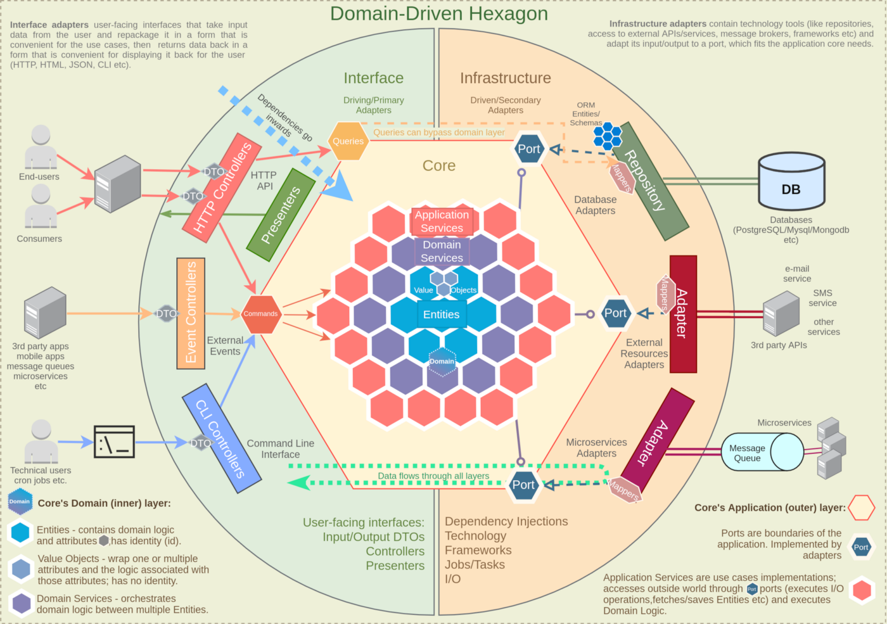
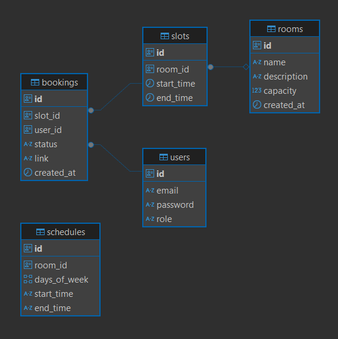

[](https://classroom.github.com/a/xR-tWBKa)


# 📅 Meeting Room Booking Service

Сервис для бронирования переговорных комнат с управлением расписанием и слотами.

## 📌 Описание

Сервис позволяет администраторам управлять переговорками и их расписанием, а пользователям — бронировать доступные временные слоты.

Слоты формируются автоматически на основе заданного расписания с фиксированной длительностью **30 минут**.

## ВОЗМОЖНОСТИ API

### 👨‍💼 Администратор
- Создание переговорок
- Создание расписания доступности (одноразовое, без возможности изменения)
- Просмотр всех броней (с пагинацией)

### 👤 Пользователь
- Просмотр списка переговорок
- Просмотр доступных слотов по дате
- Создание брони
- Отмена своей брони (идемпотентно)
- Просмотр своих будущих броней


## Стэк
- Язык: Go (>=1.25)
- База данных: PostgreSQL
- Контейнеризация: Docker, Docker Compose
- Аутентификация: JWT

## АРХИТЕКТУРА ПРОЕКТА
В рамках данного задания реализован относительно небольшой набор бизнес-функций, поэтому была выбрана **гексагональная архитектура (Hexagonal Architecture / Ports & Adapters)**.
## Database Schema



### 📌 Почему выбран данный архитектурный паттерн

В проекте используется **гексагональная архитектура (Ports & Adapters)**, так как она позволяет чётко разделить бизнес-логику и инфраструктурные детали.

Основное преимущество подхода — изоляция домена:
- бизнес-логика не зависит от базы данных, HTTP или внешних сервисов
- можно менять реализацию (например, PostgreSQL → MySQL) без изменения core-логики
- упрощается тестирование за счёт моков портов

---

## 🧩 Структура приложения

Проект разделён на **порты, адаптеры и сервисы**.

### ⚙️ Сервисы (Application / Domain layer)

Сервисы инкапсулируют основную бизнес-логику приложения:

- `authService` — аутентификация и авторизация пользователей (JWT)
- `roomService` — управление переговорками, слотами и бронированиями

Сервисы работают только с интерфейсами (портами) и не зависят от конкретных реализаций.

---

### 🔌 Порты (Ports)

Порты — это интерфейсы, определяющие контракты взаимодействия системы с внешним миром.

#### Outbound ports (исходящие)
Используются сервисами для работы с внешними зависимостями:
- работа с БД
- интеграция с внешними API (например, сервис конференций)

#### Inbound ports (входящие)
Определяют способы взаимодействия с системой:
- HTTP API (handlers)

---

### 🔧 Адаптеры (Adapters)

Адаптеры — это конкретные реализации портов:

- `storageAdapter` — реализация работы с базой данных
- `jwtAdapter` — работа с JWT (генерация и валидация токенов)
- `conferenceAdapter` — интеграция с внешним сервисом для создания ссылок на конференции

Адаптеры могут быть заменены без изменения бизнес-логики.

---
### Внешний сервис для создания ссылки на конференцию
Так как мы не подключаем сторонний сервис, и по ТЗ не можем использовать очереди задач (для ассинхронности получения ссылки), адаптер для конференций представляет собой сервис заглушку, которая через 2 секунды возвращает ссылку на мой ликтод. https://leetcode.com/maevec. Сервис, вызывающий этот адаптер, также захардкорен на контекст в 5 секунд.

### Запуск сервера
Точкой входа явялется main.go, он отдельно вынесен в папку cmd.

## 🔄 Преимущество такого подхода

- Простая замена инфраструктуры без переписывания логики
- Удобное unit-тестирование (через моки портов)
- Чёткое разделение ответственности
- Готовность к расширению (например, добавление новых интеграций)

---


## ⚠️ Принятые упрощения

С учётом небольшого объёма проекта и ограничений по времени были приняты следующие архитектурные упрощения:

- часть логики сгруппирована внутри сервисов без строгого разделения на domain и application слои
- изоляция слоёв реализована частично — в пользу упрощения структуры и повышения читаемости
- в отдельных местах допускается использование общих структур для доменной логики и HTTP-слоя (DTO не полностью выделены)
- некоторые компоненты спроектированы с прицелом на текущие требования и могут потребовать доработки при масштабировании
- перменные окружения сразу лежат в ветке для удобства, параметры в docker-compose захардкорены (для упрощения и скорости разработки)

Данные решения являются осознанными компромиссами, направленными на сокращение времени разработки без существенного влияния на корректность и читаемость системы.

## 🧪 E2E тестирование

В проекте реализованы end-to-end (E2E) тесты, покрывающие ключевые пользовательские сценарии и проверяющие систему как единое целое — от HTTP-запроса до взаимодействия с базой данных.
- создание комнаты и расписания с генерацией слотов
- букинг определнной комнаты юзеро
- отмена букинга

## 🗄️ PostgreSQL + GORM
В качестве БД была выбрана Postgre и GORM. Использован гибридный подход запросов к БД: для простых crud - методы gorm, для сложный запросов - sql код. Конечно, в больших проектах gorm замедляет работу и существенно осложняет разработку (чем SQLAlchemy, который делает обратное), но дает быстрый старт и скоращает время разработки (что критично для текущего таска).Таблицы БД выглядят следующим образом:

Генерация слотов происходит сразу же после создания расписания. Такой подход позволит разгрузить основной эндпоинт.
### Оптимизация
Для более быстрого поиска были использованы индексы:
- Уникальный индекс на email пользователя
- Уникальный индекс на slot_id в таблице bookings, для тех, кто имеет поле active 
- Индексы на поля startTime и RoomId на слоты
Индексы позволяют:
- ускорить поиск доступных слотов
- гарантировать отсутствие двойного бронирования
- повысить общую эффективность работы системы

## 🐳 Запуск
```bash
docker-compose up --build
```
Билдим контейнер, он доступен на порту 8080, Postgres - 5432

# ✅ Реализовано:
- Полный CRUD переговорок и слотов
- Генерация слотов по расписанию
- E2E тесты сценариев бронирования и отмены
- JWT-аутентификация
- Оптимизация БД и индексы
- Dockerized deployment